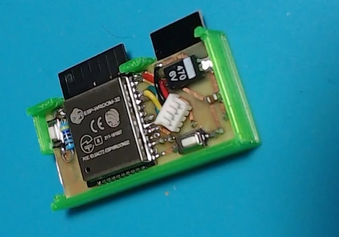
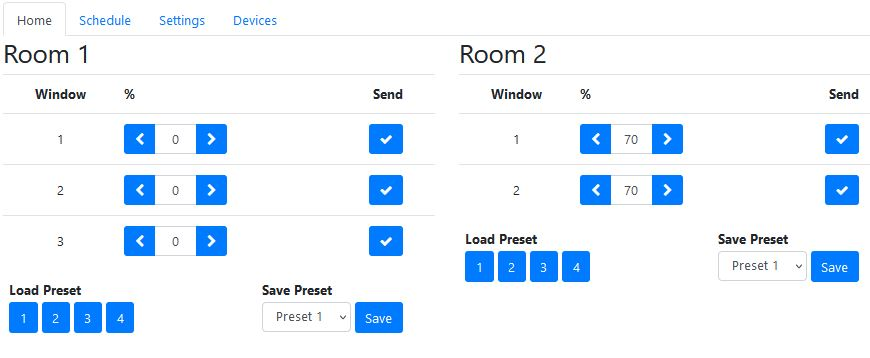
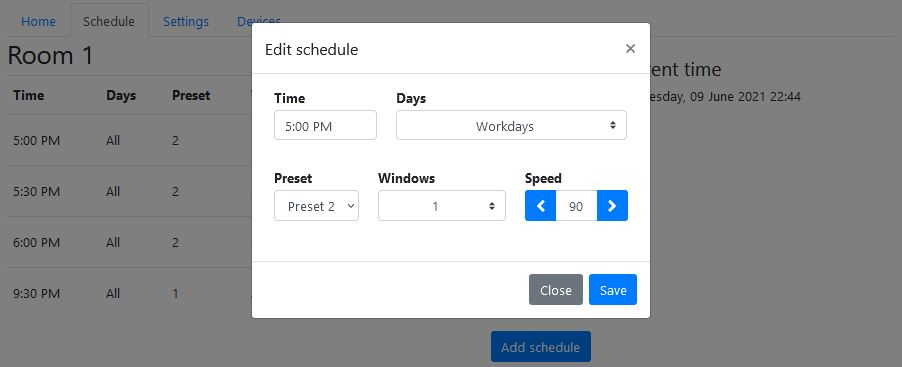
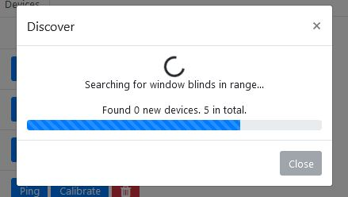

# Automatic roller blinds web interface
A small NRF24L01 to Wifi gateway. This project is used to control the  [automatic roller blinds motor](https://github.com/asafteirobert/automatic-roller-blinds-motor) project.
It runs a web server which serves a responsive web interface that allows you to control the window blinds and create schedules. It also has an RESTful API which you can use to control the window blinds from most home automation systems.

Built around an ESP32.

The server is self-contained and does not require any connection to cloud IoT services. If you want to connect to something like Blynk App you will need to implement that connectivity yourself. An internet connection is only required to periodically syncronize the time with a public NTP server.

It handles time, time zones, and daylight savings automatically, simply select your timezone.

## How to use it

The gateway is used to is used to control the  [automatic roller blinds motor](https://github.com/asafteirobert/automatic-roller-blinds-motor).

It's powered from 5V connected to the micro USB port, but can be powered by anything between 3.5V and 12V.

First you need to set the WiFi credentials. After connecting the gateway to power, wait a bit then press the BOOT button (GPIO0). This will make the gateway go into configuration mode. It will create an AP called "Window blinds WIFI config Portal". After connecting to it, a captive portal should bring you straight to the configuration page, if not, navigate to 192.168.4.1. Choose one of the access points scanned, enter password, click save. Upon successful connection, the gateway will reboot and start the web server.

Go to any browser in the local network and go to `windowblinds.local` (on Android you will unfortunately need to manually type the IP assigned by your router). Go to the Devices tab and select "Scan for devices". Finally go to the settings page and select your timezone. 

If you didn't do so already, you will need to calibrate the blinds so they know what the maximum and minimum positions are. This can be a bit tedious but should be done carefully as not doing the calibration correctly can damage the blinds. Go to the "Devices" tab and select "Calibrate". Press and hold "Move up" or "Move down" to move the blinds. When the blind is in the correct position, press "Set current position as top/bottom". Now everything is set up and you can use the blinds.

### RESTful API

All aspects of the gateway can be controlled though the RESTful API, but for home automation you should only care about these two GET endpoints:

- `windowblinds.local/setBlinds?roomId=<roomId>&blindNumber=<blindNumber>&targetPercent=<targetPercent>&speed=<speed>`

  - `roomId` and `blindNumber` select the desired blind
  - `targetPercent` sets the percentage to move to (0 - 100)
  - `speed`(optional) sets the speed to move with, in percentage of maximum speed (1 - 100)

  It returns a json with a "message" field which can be
  - `ok` - The command was successful
  - `nrf_send_fail` - The radio command was sent but no radio confirmation was received from the window blinds. The command was likely not executed. The window blind is either offline or out of range.
  - `bad_params` - some parameters are out of range
  - `missing_params` - required parameters are missing

- `windowblinds.local/getStatus?refreshPositions=<refreshPositions>`
  - `refreshPositions`(optional). If `true`, the gateway will first poll all window blinds to check their current target position, otherwise it will simply return the last known position. This is useful if you have other gateways or remotes controlling the window blinds.

  It returns a json containing all the information about the window blinds, schedules, etc.

For the rest of the endpoints, consult the source code.

## Limitations and known issues:
- The range on the NRF24L01 is pretty disappointing, so when controlling the blinds in multiple rooms, it needs to be well positioned for reliable reception. Alternatively, each room or area can each have it's own gateway.
- Android phones still don't support mDNS, so accessing the web interface needs to be done by manually finding and typing the server's local IP.
- Remember, the S in IoT stands for Security. This project is intended to run only in the local network. If you wish to connect to it remotely, you will need to secure and limit access the connection yourself.

## Making your own
All the required files are included in this project. This includes source code, 3D files to be 3D printed, schematic and PCB.
For instructions see [doc/assembly.md](doc/assembly.md).

## Working with the web files

The `data` folder is already prepared, but if you wish to make changes to the web ui, this section explains how to prepare it.

- `www` contains the static web files for the web UI. If you wish to make changes, you will likely need to change `index.html` and `js/scripts.js`
- After making the changes, simply run `tools/prepare data dir.bat` to prepapre the `data` folder. You will need Node.js. If you are not on Windows, you can follow the instructions in the bat file manually.

This step inlines most of the included files into one html and also compresses it. This significanly improves the initial loading time and stability. 

## Project status: Finished, active
All intended functionality is implemented and manually tested. I will try to fix major bugs when they are reported. I will review pull requests, but generally I prefer if you fork the project in order to make your own changes and improvements.