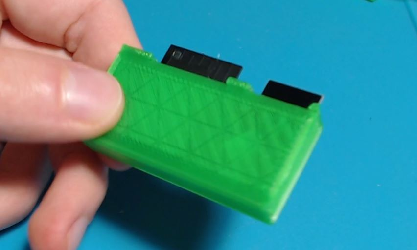

# Automatic roller blinds web interface assembly instructions

For this project you will need good soldering skills and some experience with Arduino, ESP32 and Platform IO.

## Materials
- ESP32-WROOM-32 bare module
- 0805 1uf SMD capacitor
- 2x 0805 4.7uf SMD capacitor
- 470uf 6V SMD size C tantalum capacitor
- NRF24L01+	SMD module
- 1206 10k SMD resistor
- 2x 6x3.6x2.5mm pushbuttons
- HT7333 SOT-89 LDO regulator
- Micro USB SMD connector [Something like this](https://lcsc.com/product-detail/USB-Connectors_BOOMELE-Boom-Precision-Elec-C21377_C21377.html) (optional)
- 3D printed case found in `3d print` folder(optional))
- PCB

## The circuit board

If you want to use the 3D printed case, the PCB should be around 0.8mm thick.

You can find the schematic and PCB in the `schematic` folder. It contains an EasyEDA project and Gerber files.

Or simply order the it from this link: [https://www.pcbway.com/project/shareproject/](https://www.pcbway.com/project/shareproject/)

## Steps

1. Solder the components to the PCB. Note that the microusb connector can be difficult to solder currectly. Alternatively, you can solder wires and supply any voltage between 3.5V and 12V.
2. Solder wires to the TX, RX, GND and 3V3 pads and connect them to your USB serial adapter.
3. Put the ESP32 in upload mode by holding both RESET and BOOT, then releasing RESET, then releasing BOOT.
4. Open this project in Platform IO.
5. In Platform IO Select Build Filesystem Image, then Upload Filesystem Image
6. Finally upload the code by selecting Upload.
7. Test that it works.
8. Optionally place the board in the 3D printed case.

